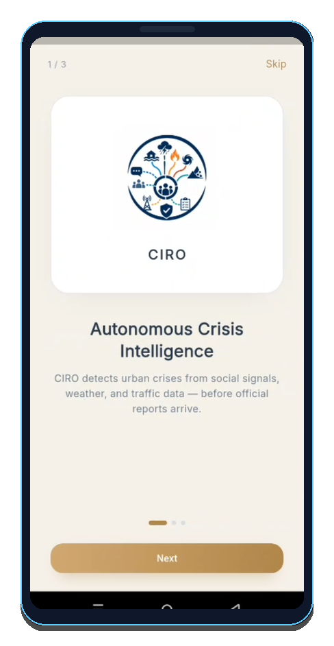
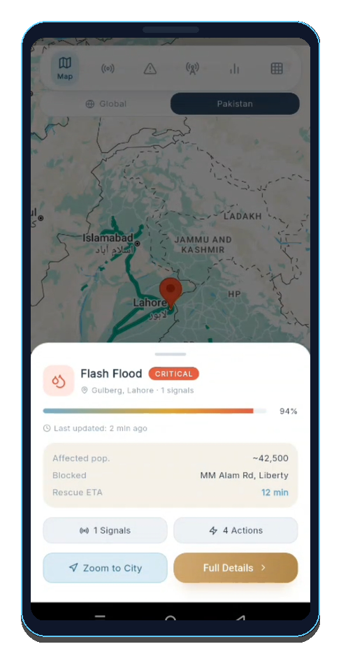
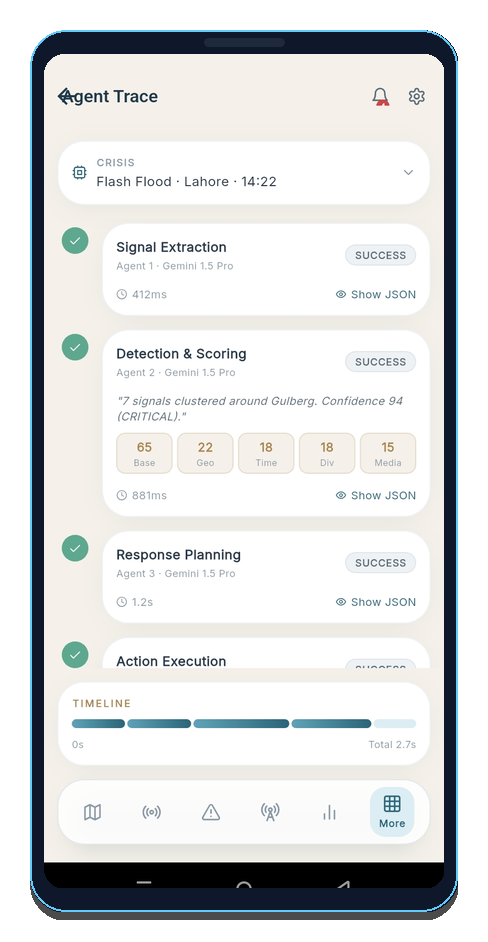
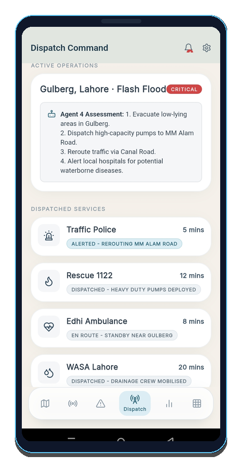
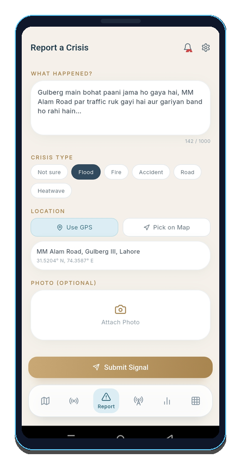
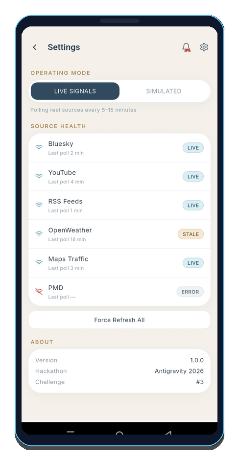
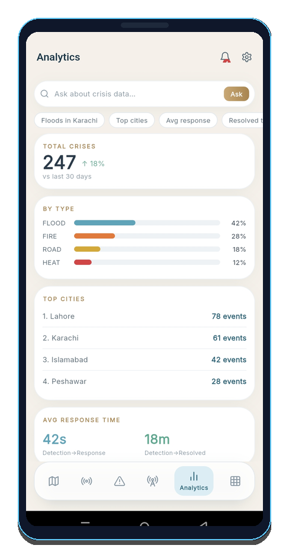

<div align="center">

# 🚨 CIRO — Crisis Intelligence & Response Operations

**An Autonomous Multi-Agent Platform for Real-Time Crisis Detection, Geo-Mapping, and Coordinated Response Execution.**

[](https://flutter.dev)
[](https://python.org)
[](https://react.dev)
[](https://firebase.google.com)
[](https://git-lfs.github.com)
[](#license)

<br/>

[](https://github.com/Daniyal-Jamil-2005/CIRO/raw/main/base.apk)

*Includes cross-platform mobile dispatch app (Android/iOS), autonomous 4-stage Python backend agent pipeline, real-time Firestore database sync, and modern web monitoring dashboard.*

</div>

---

## 📥 Direct Android APK Download

Get the compiled mobile application directly on your Android device:

| Package | Direct Link | File Size | Description |
| :--- | :--- | :--- | :--- |
| 📱 **Base APK** *(Recommended)* | [**Download base.apk**](https://github.com/Daniyal-Jamil-2005/CIRO/raw/main/base.apk) | `124 MB` | Full universal Android build with Google Maps & Firebase SDKs |
| 📱 **CIRO Release APK** | [**Download CIRO.apk**](https://github.com/Daniyal-Jamil-2005/CIRO/raw/main/CIRO.apk) | `124 MB` | Production release candidate build |

### 📲 Quick Installation Steps (Android)
1. Tap **[Download base.apk](https://github.com/Daniyal-Jamil-2005/CIRO/raw/main/base.apk)** on your Android device.
2. If prompted by Chrome/Browser, enable **"Allow installation from this source"**.
3. Open the downloaded `.apk` file and tap **Install**.
4. Open **CIRO** and grant Location permissions for live crisis geo-mapping.

---

## 📱 Mobile App Showcase

> The mobile app is designed with Material Design 3 and Riverpod state management, providing first-responders and citizens with real-time crisis intelligence and dispatch operations.

<p align="center">
  
  &nbsp;&nbsp;
  
  &nbsp;&nbsp;
  
</p>

<p align="center">
  <b>Left:</b> Intelligence Hub & Landing &nbsp;|&nbsp; 
  <b>Center:</b> Live Crisis Geo-Map & Heatmaps &nbsp;|&nbsp; 
  <b>Right:</b> 4-Agent Pipeline Trace
</p>

<br/>

<p align="center">
  
  &nbsp;&nbsp;
  
  &nbsp;&nbsp;
  
  &nbsp;&nbsp;
  
</p>

<p align="center">
  <b>1. Response Plan:</b> AI Strategy & Authority Alerting &nbsp;|&nbsp; 
  <b>2. Report Crisis:</b> Citizen Reporting &nbsp;|&nbsp; 
  <b>3. Signal Stream:</b> Ingested Feeds &nbsp;|&nbsp; 
  <b>4. Analytics:</b> Impact & Severity Metrics
</p>


## 🏗️ System Architecture

CIRO bridges automated social/environmental signal ingestion with an autonomous 4-stage AI pipeline, keeping mobile dispatchers and web command centers synchronized via Firebase Firestore.

```
                               ┌─────────────────────────┐
                               │   Signal Ingestion      │
                               │  ├─ Social Media Feed   │
                               │  └─ Weather Poller API  │
                               └────────────┬────────────┘
                                            │ Raw Signals
                                            ▼
┌────────────────────────────────────────────────────────────────────────────────────────┐
│                        Autonomous 4-Agent Python Pipeline                              │
│                                                                                        │
│  ┌──────────────────┐    ┌──────────────────┐    ┌──────────────────┐    ┌───────────┐ │
│  │ Agent 1:         │───>│ Agent 2:         │───>│ Agent 3:         │───>│ Agent 4:  │ │
│  │ Extraction       │    │ Detection        │    │ Planning         │    │ Execution │ │
│  │ Parse & Cleanse  │    │ Classify & Rate  │    │ Action Matrix    │    │ Dispatch  │ │
│  └──────────────────┘    └──────────────────┘    └──────────────────┘    └───────────┘ │
└───────────────────────────────────────────┬────────────────────────────────────────────┘
                                            │ Real-time Sync
                                            ▼
                               ┌─────────────────────────┐
                               │   Firebase Firestore    │
                               │  ├─ /crises             │
                               │  ├─ /signals            │
                               │  ├─ /dispatches         │
                               │  └─ /agent_traces       │
                               └────────────┬────────────┘
                                            │
                     ┌──────────────────────┴──────────────────────┐
                     ▼                                             ▼
       ┌───────────────────────────┐                 ┌───────────────────────────┐
       │   Flutter Mobile App      │                 │    React Web Dashboard    │
       │   (iOS / Android / Web)   │                 │   (Incident Control Center)│
       └───────────────────────────┘                 └───────────────────────────┘
```

### 🧠 The 4-Agent Pipeline Breakdown
1. **Agent 1: Extraction**: Ingests raw unstructured streams (tweets, emergency reports, weather alerts) and extracts entities, timestamps, and locations.
2. **Agent 2: Detection**: Clusters related signals into distinct crisis incidents, assigns confidence scores, and rates severity (LOW, MEDIUM, HIGH, CRITICAL).
3. **Agent 3: Planning**: Generates step-by-step emergency response protocols, calculating resource requirements and affected population estimates.
4. **Agent 4: Execution**: Automates authority alerts, routes dispatch instructions to ground responders via mobile notifications, and updates live status records.

---

## 🛠️ Tech Stack

### Mobile Application (`ciro_app/`)
* **Framework**: [Flutter 3.10+](https://flutter.dev) (iOS, Android, Web target)
* **State Management**: [Riverpod 3.3+](https://riverpod.dev)
* **Database**: Firebase Cloud Firestore
* **Mapping**: Google Maps SDK (`google_maps_flutter`)
* **Design System**: Material Design 3 with custom CIRO dark theme
* **Iconography**: Lucide Icons & Material Symbols

### Backend Engine (`backend/`)
* **Language**: Python 3.8+
* **Framework**: Flask microservice framework
* **Task Scheduler**: APScheduler for poller cycles
* **Integrations**: Twitter API v2, OpenWeatherMap API, Firebase Admin SDK
* **Testing**: pytest framework

### Web Control Center (`Ui/`)
* **Framework**: [React 18](https://react.dev) with [TypeScript](https://www.typescriptlang.org)
* **Build System**: [Vite](https://vitejs.dev)
* **Styling**: PostCSS, TailwindCSS, shadcn/ui component patterns

---

## 📁 Repository Structure

```
CIRO/
├── .gitattributes               # Git LFS tracking rules (*.apk)
├── base.apk                     # Universal Android Release Build (124 MB)
├── CIRO.apk                     # Production Release Candidate Build (124 MB)
│
├── ciro_app/                    # Flutter Mobile Application
│   ├── lib/
│   │   ├── main.dart            # Flutter entry point
│   │   ├── theme.dart           # MD3 dark theme tokens
│   │   ├── ui/                  # Mobile screens & components
│   │   ├── providers/           # Riverpod state providers
│   │   └── utils/               # Formatting & crisis helpers
│   ├── android/                 # Android Gradle project
│   ├── ios/                     # iOS Xcode project
│   ├── web/                     # Web build setup
│   └── pubspec.yaml             # Dart dependencies
│
├── backend/                     # Python 4-Agent Pipeline
│   ├── agents/                  # Multi-stage crisis agents
│   │   ├── agent_1_extraction/
│   │   ├── agent_2_detection/
│   │   ├── agent_3_planning/
│   │   └── agent_4_execution/
│   ├── pollers/                 # External data ingestion workers
│   ├── requirements.txt         # Python dependencies
│   └── deploy_backend.ps1       # Powershell deployment script
│
├── Ui/                          # React Web Control Center
│   ├── src/                     # React/TS source code
│   ├── vite.config.ts           # Vite build config
│   └── package.json             # NPM package manifest
│
├── docs/                        # Screenshots & Assets
│   └── assets/screenshots/      # Framed device showcase images
│
└── Antigravity traces/          # Specifications & Documentation
    ├── CIRO_Design_Spec.md      # Design guidelines
    └── CIRO_Project_Doc.md      # Technical specifications
```

---

## 🚀 Getting Started & Local Setup

### 1. Prerequisites
- **Flutter SDK**: `^3.10.0`
- **Node.js**: `^18.0.0`
- **Python**: `^3.8`
- **Firebase Account**: Cloud Firestore enabled project

---

### 2. Flutter Mobile Application

```bash
# Navigate to mobile app directory
cd ciro_app

# Install Dart dependencies
flutter pub get

# Run on connected Android/iOS device or emulator
flutter run

# Run on Chrome web browser
flutter run -d chrome
```

#### Build Release APK:
```bash
flutter build apk --release
```

---

### 3. Python Backend & Multi-Agent Pipeline

```bash
# Navigate to backend directory
cd backend

# Create virtual environment
python -m venv venv
# On Windows:
.\venv\Scripts\activate
# On Linux/macOS:
source venv/bin/activate

# Install required dependencies
pip install -r requirements.txt

# Run backend deployment script
powershell -ExecutionPolicy Bypass -File deploy_backend.ps1
```

---

### 4. React Web Control Center

```bash
# Navigate to Web UI directory
cd Ui

# Install dependencies
npm install

# Start local Vite development server
npm run dev
```

---

## 📊 Firebase Firestore Schema

### Crisis Document (`/crises/{crisis_id}`)
```json
{
  "id": "crs_984721",
  "title": "Severe Wildfire Spreading Near Pine Ridge",
  "type": "FIRE",
  "location": {
    "lat": 34.0522,
    "lng": -118.2437
  },
  "location_raw": "Pine Ridge Sector 4, CA",
  "severity": "CRITICAL",
  "confidence_score": 94.5,
  "status": "ACTIVE",
  "affected_population": 12500,
  "timestamp": "2026-08-26T18:30:00Z",
  "response_plan": {
    "evacuation_routes": ["HWY 101 North", "Pine Valley Rd"],
    "shelters": ["Central High Gym", "Civic Center"],
    "dispatched_units": ["Fire Battalion 4", "Red Cross Unit 2"]
  }
}
```

---

## 📄 Documentation Links

- 📐 [Design Specifications](Antigravity%20traces/CIRO_Design_Spec.md)
- 📜 [Technical Architecture & Schema Doc](Antigravity%20traces/CIRO_Project_Doc.md)
- 🗺️ [Implementation Plan](Antigravity%20traces/implementation_plan.md)

---

## 👤 Author & Maintainer

**Daniyal Jamil**  
- **GitHub**: [@Daniyal-Jamil-2005](https://github.com/Daniyal-Jamil-2005)  
- **Repository**: [https://github.com/Daniyal-Jamil-2005/CIRO](https://github.com/Daniyal-Jamil-2005/CIRO)

---

## 🛡️ License

Proprietary — All rights reserved © Daniyal Jamil 2026.
